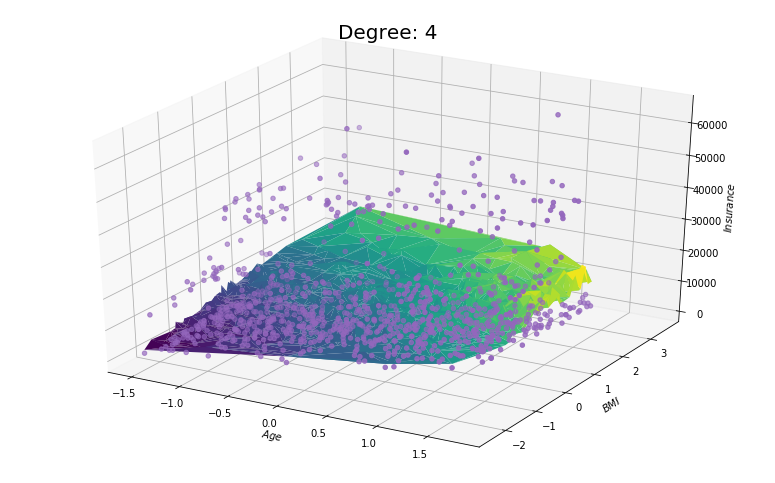

# Introduction

Another form of shrinkage that can be applied to the OLS problem is the Lasso. In this case, an $L_1$ penalty is added to the loss function, which has the effect of bringing model parameters to zero for a large enough value of the associated tuning parameter. In other words, this penalty performs automated feature selection since possibly some of the model parameters will be brought to zero.  

However, unlike the previous models, no closed-form solution exists due to the fact that the loss function is no longer continuously differentiable (non-smooth absolute component). Thus, discrete optimization techniques are needed to solve for the parameter estimates. Numerous algorithms, such as the LARS (Least Angle Regression) algorithm and the Forward Stepwise regression algorithm have been developed to solve the Lasso, however the Pathwise Coordinate Descent algorithm is leveraged here. 

