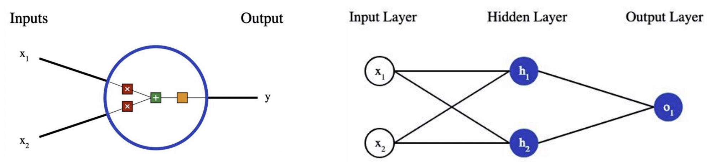

\newpage

```{r include=FALSE}
knitr::opts_chunk$set(fig.show='hold', fig.pos = 'H')
library(knitr)
library(reticulate)
library(magrittr)
use_python("/usr/local/bin/python3")
py_config()
```

# 简介

此文档为两个算法的代码文档，包括了**Logisitic 回归**和**神经网络**两个模型算法，文件编码：UTF-8

1. model 文件夹：存放两个算法模型的类
2. source 文件夹：存放依赖函数

代码同时开源托管在 github: [点击访问](https://github.com/wuyuchong/DataMining/tree/master/HomeWork)

# Logistic 回归算法

我们使用**梯度下降**的优化方法构建 logit 模型。

## 模型求解步骤

如果p是一个事件的概率，这个事件的发生比率就是p/(1-p)。逻辑回归就是建立模型预测这一比率的对数:

$$\log \left(\frac{p}{1-p}\right)=\beta_{0}+\beta_{1} x_{1}+\cdots+\beta_{P} x_{P}$$

即：

$$p=\frac{1}{1+\exp \left[-\left(\beta_{0}+\beta_{1} x_{1}+\cdots+\beta_{P} x_{P}\right)\right]}$$

假设我们有n个独立的训练样本{(x1, y1) ,(x2, y2),…, (xn, yn)}，y={0, 1}。那每一个观察到的样本(xi, yi)出现的概率是：

$$P\left(\mathrm{y}_{i}, \mathrm{x}_{i}\right)=P\left(\mathrm{y}_{i}=1 | \mathrm{x}_{i}\right)^{y_{i}}\left(1-P\left(\mathrm{y}_{i}=1 | \mathrm{x}_{i}\right)\right)^{1-y_{i}}$$

那我们的整个样本集，也就是n个独立的样本出现的似然函数为:

$$L(\theta)=\prod P\left(\mathrm{y}_{i}=1 | \mathrm{x}_{i}\right)^{y_{i}}\left(1-P\left(\mathrm{y}_{i}=1 | \mathrm{x}_{i}\right)\right)^{1-y_{i}}$$

那么，损失函数（cost function）就是最大似然函数**取对数**。 ^[最大似然法就是求模型中使得似然函数最大的系数取值*]

用$L(\theta)$对$\theta$求导，得到：

$$\frac{\partial L(\theta)}{\partial \theta}=\sum_{i=1}^{n} y_{i} x_{i}-\sum_{i}^{n} \frac{e^{\theta^{T} x_{i}}}{1+e^{\theta_{x_{i}}}} x_{i}=\sum_{i=1}^{n}\left(y_{i}-\sigma\left(\theta^{T} x_{i}\right)\right) x_{i}$$

令该导数为0，无法解析求解。使用梯度下降法 @汪宝彬2011随机梯度下降法的一些性质 ，那么：

$$\theta^{t+1}=\theta^{t}-\alpha \frac{\partial L(\theta)}{\partial \theta}=\theta^{t}-\alpha \sum_{i=1}^{n}\left(y_{i}-\sigma\left(\theta^{T} x_{i}\right)\right) x_{j}$$

在进行训练之前，我们对各个变量的数据进行标准化处理。然后，我们让学习率逐步递减进行训练。 @LiFeng

## 代码实现 - 逐步讲解（Step by Step）

### 包和数据导入

```{r}
import numpy as np
import math
from sklearn import datasets
```

我们读取经典的 iris 数据集。 ^[只展示前5行]

```{r}
iris = datasets.load_iris()
X = iris['data']
y = iris['target']
X = X[y!=2]
y = y[y!=2]
X[0:5]
y[0:5]
```

### 定义sigmoid函数

```{r echo=FALSE}
## 画sigmoid函数
sigmoid = function(x)
{
  outcome = 1/(1+exp(-x))
  return(outcome)
}
```

```{r echo=FALSE, fig.align='center', fig.cap='sigmoid function', out.width='40%'}
curve(1/(1+exp(-x)), from = -6, to = 6, n = 100, add = FALSE, type = "l", xlab = 'x', ylab = 'y')
```

适用于向量的 sigmoid 函数

```{r}
def sigmoidVector(Xi,thetas):
    params = - np.sum(Xi * thetas)
    outcome = 1 /(1 + math.exp(params))
    return outcome
```

适用于矩阵的 sigmoid 函数

```{r}
def sigmoidMatrix(Xb,thetas):
    params = - Xb.dot(thetas)
    outcome = np.zeros(params.shape[0])
    for i in range(len(outcome)):
        outcome[i] = 1 /(1 + math.exp(params[i]))
    return outcome
```

带阈值判别的 sigmoid 函数

- 阈值（threshold）：用于给出概率后进行分类，默认为 50%

```{r}
def sigmoidThreshold(Xb,thetas):
    params = - Xb.dot(thetas)
    outcome = np.zeros(params.shape[0])
    for i in range(len(outcome)):
        outcome[i] = 1 /(1 + math.exp(params[i]))
        if outcome[i] >= 0.5:
            outcome[i] = 1
        else:
            outcome[i] = 0
    return outcome
```

### 定义损失函数

损失函数（cost function）就是最大似然函数**取对数**

```{r}
def costFunc(Xb,y):
    sum = 0.0
    for i in range(m):
        yPre = sigmoidVector(Xb[i,], thetas)
        if yPre == 1 or yPre == 0:
            return float(-2**31)
        sum += y[i] * math.log(yPre) + (1 - y[i]) * math.log(1-yPre)
    return -1/m * sum
```

### 用梯度下降法进行训练

初始化：

- 学习率（alpha）：用于调整每次迭代的对损失函数的影响大小
- 准确度（accuracy）：作为终止迭代的评判指标

```{r}
thetas = None
m = 0
alpha = 0.01
accuracy = 0.001
```


在第一列插入1，构成 Xb 矩阵

```{r}
thetas = np.full(X.shape[1]+1,0.5)
m = X.shape[0]
a = np.full((m, 1), 1)
Xb = np.column_stack((a, X))
n = X.shape[1] + 1
```

使用梯度下降法进行迭代：

```{r}
count = 1
while True:
    before = costFunc(Xb, y)
    c = sigmoidMatrix(Xb, thetas)-y
    for j in range(n):
        thetas[j] = thetas[j] -alpha * np.sum(c * Xb[:,j])
    after = costFunc(Xb, y)
    if after == before or math.fabs(after - before) < accuracy:
        print("迭代完成，损失函数值:",after)
        break
    print("迭代次数:",count)
    print("损失函数变化",(after - before))
    count += 1
```

迭代完成后得到的参数：

```{r}
thetas
```

### 预测

进行样本内预测：

```{r}
a = np.full((len(X),1),1)
Xb = np.column_stack((a,X))
sigmoidThreshold(Xb, thetas)
```

## 代码实现 - 类封装

可以调整的参数包括：

- 学习率（alpha）：用于调整每次迭代的对损失函数的影响大小
- 准确度（accuracy）：作为终止迭代的评判指标
- 阈值（threshold）：用于给出概率后进行分类，默认为 50%

```{r}
# ----------------- 导入基本模块 -----------------
import numpy as np
import math

# ------------ 导入source中定义的函数 ------------
from source.sigmoidVector import sigmoidVector
from source.sigmoidMatrix import sigmoidMatrix
from source.sigmoidThreshold import sigmoidThreshold
    
# ----------------- 定义 base 类 -----------------
class Regression(object):
    def __init__(self, X, y, threshold = 0.5):
        self.thetas = None
        self.X = X
        self.y = y

# ---------------- 定义逻辑回归类 ----------------
class LogisticRegression(Regression):
    def __init__(self, X, y, threshold = 0.5):
        Regression.__init__(self, X, y, threshold = 0.5) # 继承 Regression 类
        self.m = 0
        self.threshold = threshold
        self.epoch = 1
    
    def fit(self, alpha = 0.01, accuracy = 0.001):
        self.thetas = np.full(self.X.shape[1] + 1,0.5)
        self.m = self.X.shape[0]
        a = np.full((self.m, 1), 1)
        Xb = np.column_stack((a,self.X))
        n  = self.X.shape[1]+1

        while True:
            before = self.costFunc(Xb, y)
            c = sigmoidMatrix(Xb, self.thetas) - y
            for j in range(n):
                self.thetas[j] = self.thetas[j] - alpha * np.sum(c * Xb[:,j])
            after = self.costFunc(Xb, y)
            if after == before or math.fabs(after - before) < accuracy:
                break
            self.epoch += 1
 
    def costFunc(self, Xb, y):
        sum = 0.0
        for i in range(self.m):
            yPre = sigmoidVector(Xb[i,], self.thetas)
            if yPre == 1 or yPre == 0:
                return float(-2**31)
            sum += y[i] * math.log(yPre) + (1 - y[i]) * math.log(1 - yPre)
        return -1/self.m * sum
        
    def predict(self):
        a = np.full((len(X), 1), 1)
        Xb = np.column_stack((a, X))
        return sigmoidThreshold(Xb, self.thetas, self.threshold)
```

## 测试用例

我们使用经典的 iris 数据集作为测试用例，为了验证算法正确性，我们进行样本内预测。

```{r}
iris = datasets.load_iris()
X = iris['data']
y = iris['target']
X = X[y!=2]
y = y[y!=2]

Logstic = LogisticRegression(X, y, threshold = 0.5)    
Logstic.fit(alpha = 0.01, accuracy = 0.001)
print("epoch:",Logstic.epoch)
print("theta:",Logstic.thetas)
y_predict = Logstic.predict()
y_predict
```

# 神经网络算法

我们使用**随机梯度下降**的优化方法构建一个较为简单的神经网络模型。  ^[考虑到神经网络是较为复杂的一类模型，在此我们只构造它的初始版本，限制较多，不具备广泛实用性。] @neuralnetwork

## 模型求解步骤

### 神经元

神经元是神经网络的基本单元。 @Chua1988Cellular 神经元先获得输入，然后执行某些数学运算后，再产生一个输出。 @庄镇泉1990神经网络与神经计算机:第二讲

对于一个二输入神经元，输出步骤为：
先将两个输入乘以权重，把两个结果想加，再加上一个偏置，最后将它们经过激活函数处理得到输出。 ^[神经元（Neurons）权重（weight）偏置（bias）激活函数（activation function）]

$$y = f(x1 × weight_1a + x2 × weight_1b + b)$$

我们选择 sigmoid 函数作为神经网络的激活函数。

$$S(x) = \frac{1}{1 + e^{-x}}$$

$$S'(x) = \frac{e^{-x}}{(1 + e^{-x})^2} = S(x)(1-S(x))$$

### 神经网络

我们搭建一个具有2个输入、一个包含2个神经元的隐藏层（h1和h2）、包含1个神经元的输出层（o1）的简单神经网络。 
^[A neural network with:
        - 2 inputs
        - a hidden layer with 2 neurons (h1, h2)
        - an output layer with 1 neuron (o1)]
 @阎平凡2005人工神经网络与模拟进化计算

### 前馈

把神经元的输入向前传递获得输出的过程称为前馈 ^[前馈（feedforward）]

### 损失

在训练神经网络之前，我们需要有一个标准定义，以便我们进行改进。我们采用均方误差（MSE）来定义损失（loss）：

$$ \mathrm{MSE} = \frac{1}{n} \sum_{i=1}^n (y_{true} - y_{pred}) $$

我们在训练中每次只取一个样本，那么损失函数为：

$$ \begin{aligned} \mathrm{MSE} &=\frac{1}{1} \sum_{i=1}^{1}\left(y_{t r u e}-y_{p r e d}\right)^{2} \\ &=\left(y_{t r u e}-y_{p r e d}\right)^{2} \\ &=\left(1-y_{p r e d}\right)^{2} \end{aligned} $$

### 训练神经网络

训练神经网络就是将损失最小化，预测结果越好，损失就越低。


由于预测值是由一系列网络权重和偏置计算出来的，所以损失函数实际上是包含多个权重、偏置的多元函数：

$$L\left(w_{1}, w_{2}, w_{3}, w_{4}, w_{5}, w_{6}, b_{1}, b_{2}, b_{3}\right)$$
由链式求导法则（以weight_1a为例）：

$$\frac{\partial L}{\partial w_{1}}=\frac{\partial L}{\partial y_{p r e d}} * \frac{\partial y_{p r e d}}{\partial h_{1}} * \frac{\partial h_{1}}{\partial w_{1}}$$

这种向后计算偏导数的系统称为反向传导。 ^[反向传导（backpropagation）]

### 随机梯度下降优化方法

我们使用随机梯度下降（SGD）的优化算法 @王功鹏2018基于卷积神经网络的随机梯度下降算法 来逐步改变网络的权重w和偏置b，使损失函数会缓慢降低，从而改进我们的神经网络。以weight_1a为例：

$$w_{1} \leftarrow w_{1}-\eta \frac{\partial L}{\partial w_{1}}$$

### 权重的初始化

神经网络中结点的各权重(weight)和偏置(bias) 的初始化均服从标准正态分布

$$ Weight_i,Bias_i \sim N(0,1)$$

## 代码实现 - 逐步讲解（Step by Step）

### 包和数据导入

```{r}
import numpy as np
import math
```

我们读取经典的 iris 数据集，取其前两个自变量。 ^[只展示前5行]

```{r}
iris = datasets.load_iris()
X = iris['data']
y = iris['target']
X = X[y!=2][:,0:2]
y = y[y!=2]
X[0:5]
y[0:5]
```

### 定义 sigmoid 函数

$$f(x) = \frac{1}{1 + e^{-x}}$$

```{r}
def sigmoid(x):
    return 1 / (1 + np.exp(-x))
```

### 定义 sigmoid 的导函数

$$\frac{\mathrm{d}f}{\mathrm{d}x} = f(x) * (1 - f(x))$$

```{r}
def sigmoidDerivative(x):
    fx = sigmoid(x)
    return fx * (1 - fx)
```

### 定义均方误差损失函数：

$$ \mathrm{MSE} = \frac{1}{n} \sum_{i=1}^n (y_{true} - y_{pred}) $$

```{r}
def mse(y_true, y_pred):
    return ((y_true - y_pred) ** 2).mean()
```


### 权重和截距的初始化

$$L\left(w_{1}, w_{2}, w_{3}, w_{4}, w_{5}, w_{6}, b_{1}, b_{2}, b_{3}\right)$$

```{r echo=FALSE, fig.align='center', fig.cap='搭建的神经网络示意图', out.width='80%'}

```

```{r}
weight_1a = np.random.normal()
weight_1b = np.random.normal()
weight_2a = np.random.normal()
weight_2b = np.random.normal()
weight_o1 = np.random.normal()
weight_o2 = np.random.normal()

bias_1 = np.random.normal()
bias_2 = np.random.normal()
bias_o = np.random.normal()
```

### 前馈

将输入向前传递获得输出。

```{r}
def feedforward(x):
    h1 = sigmoid(weight_1a * x[0] + weight_1b * x[1] + bias_1)
    h2 = sigmoid(weight_2a * x[0] + weight_2b * x[1] + bias_2)
    o1 = sigmoid(weight_o1 * h1 + weight_o2 * h2 + bias_o)
    return o1
```

### 设置学习率和迭代次数

```{r}
learn_rate = 0.1
epochs = 1000
record = np.array((None, None))
```

### 训练神经网络

```{r}
record = np.array([None, None])
for epoch in range(epochs):
    for x, y_true in zip(X, y):
        # 初次前馈
        sum_h1 = weight_1a * x[0] + weight_1b * x[1] + bias_1
        h1 = sigmoid(sum_h1)

        sum_h2 = weight_2a * x[0] + weight_2b * x[1] + bias_2
        h2 = sigmoid(sum_h2)

        sum_o1 = weight_o1 * h1 + weight_o2 * h2 + bias_o
        o1 = sigmoid(sum_o1)
        y_pred = o1

        # 计算导数
        L_ypred = -2 * (y_true - y_pred)

        # 输出层
        ypred_weight_o1 = h1 * sigmoidDerivative(sum_o1)
        ypred_weight_o2 = h2 * sigmoidDerivative(sum_o1)
        ypred_bias_o = sigmoidDerivative(sum_o1)

        ypred_h1 = weight_o1 * sigmoidDerivative(sum_o1)
        ypred_h2 = weight_o2 * sigmoidDerivative(sum_o1)

        # 隐藏层 1
        h1_weight_1a = x[0] * sigmoidDerivative(sum_h1)
        h1_weight_1b = x[1] * sigmoidDerivative(sum_h1)
        h1_bias_1 = sigmoidDerivative(sum_h1)

        # 隐藏层 2
        h2_weight_2a = x[0] * sigmoidDerivative(sum_h2)
        h2_weight_2b = x[1] * sigmoidDerivative(sum_h2)
        h2_bias_2 = sigmoidDerivative(sum_h2)

        # 迭代权重和偏差
        # 隐藏层 1
        weight_1a -= learn_rate * L_ypred * ypred_h1 * h1_weight_1a
        weight_1b -= learn_rate * L_ypred * ypred_h1 * h1_weight_1b
        bias_1 -= learn_rate * L_ypred * ypred_h1 * h1_bias_1

        # 隐藏层 2
        weight_2a -= learn_rate * L_ypred * ypred_h2 * h2_weight_2a
        weight_2b -= learn_rate * L_ypred * ypred_h2 * h2_weight_2b
        bias_2 -= learn_rate * L_ypred * ypred_h2 * h2_bias_2

        # 输出层
        weight_o1 -= learn_rate * L_ypred * ypred_weight_o1
        weight_o2 -= learn_rate * L_ypred * ypred_weight_o2
        bias_o -= learn_rate * L_ypred * ypred_bias_o

    # 预测和计算损失函数，并保存
    y_preds = np.apply_along_axis(feedforward, 1, X)
    loss = mse(y, y_preds)
    new = np.array([epoch, loss])
    record = np.vstack([record,new])
```

### 查看损失函数的变化

```{r}
record[1:10:,1]
```

我们画出损失函数的变化图像，可以看出，随着迭代次数的增加，均方误差先快速减小，后趋向于稳定。

```{r echo=FALSE, fig.align='center', fig.cap='损失函数的变化图像', out.width='60%'}
table = read.csv("record.csv")
plot(table, xlab = "epochs", ylab = "MSE")
```

### 预测

为了验证算法正确性，我们进行样本内预测。

预测第 1 个样本:

```{r}
X[0]
y[0]
y_preds = feedforward(X[0])
y_preds
```

预测第 100 个样本:

```{r}
X[99]
y[99]
y_preds = feedforward(X[99])
y_preds
```

## 代码实现 - 类封装

可以调整的参数包括：

- 迭代次数（epochs）：理论上迭代次数越多越精确，耗时越长，默认为100次
- 学习率（learn_rate）：默认为0.1，可进一步调优

```{r}
# ----------------- 导入基本模块 -----------------
import numpy as np
import math

# ------------ 导入source中定义的函数 ------------
from source.sigmoid import sigmoid
from source.sigmoidDerivative import sigmoidDerivative
from source.mse import mse

# ---------------- 定义神经网络类 ----------------
class NeuralNetwork:
    def __init__(self, X, y, learn_rate = 0.1, epochs = 100):
        # 学习率和迭代次数
        self.learn_rate = learn_rate
        self.epochs = epochs
        # 数据
        self.X = X
        self.y = y
        # 权重和截距的初始化
        self.weight_1a = np.random.normal()
        self.weight_1b = np.random.normal()
        self.weight_2a = np.random.normal()
        self.weight_2b = np.random.normal()
        self.weight_o1 = np.random.normal()
        self.weight_o2 = np.random.normal()
        self.bias_1 = np.random.normal()
        self.bias_2 = np.random.normal()
        self.bias_o = np.random.normal()
        # 记录损失函数值
        self.record = np.array([None, None])
    
    # 定义前馈
    def feedforward(self, x):
        h1 = sigmoid(self.weight_1a * x[0] + self.weight_1b * x[1] + self.bias_1)
        h2 = sigmoid(self.weight_2a * x[0] + self.weight_2b * x[1] + self.bias_2)
        o1 = sigmoid(self.weight_o1 * h1 + self.weight_o2 * h2 + self.bias_o)
        return o1
    
    # 定义预测函数
    def predict(self):
        y_preds = np.apply_along_axis(self.feedforward, 1, self.X)
        return y_preds 
    
    # 定义训练函数
    def train(self):
        for epoch in range(self.epochs):
            for x, y_true in zip(self.X, self.y):
                # 初次前馈
                sum_h1 = self.weight_1a * x[0] + self.weight_1b * x[1] + self.bias_1
                h1 = sigmoid(sum_h1)
        
                sum_h2 = self.weight_2a * x[0] + self.weight_2b * x[1] + self.bias_2
                h2 = sigmoid(sum_h2)
        
                sum_o1 = self.weight_o1 * h1 + self.weight_o2 * h2 + self.bias_o
                o1 = sigmoid(sum_o1)
                y_pred = o1
        
                # 计算导数
                L_ypred = -2 * (y_true - y_pred)
        
                # 输出层
                ypred_weight_o1 = h1 * sigmoidDerivative(sum_o1)
                ypred_weight_o2 = h2 * sigmoidDerivative(sum_o1)
                ypred_bias_o = sigmoidDerivative(sum_o1)
        
                ypred_h1 = self.weight_o1 * sigmoidDerivative(sum_o1)
                ypred_h2 = self.weight_o2 * sigmoidDerivative(sum_o1)
        
                # 隐藏层 1
                h1_weight_1a = x[0] * sigmoidDerivative(sum_h1)
                h1_weight_1b = x[1] * sigmoidDerivative(sum_h1)
                h1_bias_1 = sigmoidDerivative(sum_h1)
        
                # 隐藏层 2
                h2_weight_2a = x[0] * sigmoidDerivative(sum_h2)
                h2_weight_2b = x[1] * sigmoidDerivative(sum_h2)
                h2_bias_2 = sigmoidDerivative(sum_h2)
        
                # # 迭代权重和偏差
                # 隐藏层 1
                self.weight_1a -= self.learn_rate * L_ypred * ypred_h1 * h1_weight_1a
                self.weight_1b -= self.learn_rate * L_ypred * ypred_h1 * h1_weight_1b
                self.bias_1 -= self.learn_rate * L_ypred * ypred_h1 * h1_bias_1
        
                # 隐藏层 2
                self.weight_2a -= self.learn_rate * L_ypred * ypred_h2 * h2_weight_2a
                self.weight_2b -= self.learn_rate * L_ypred * ypred_h2 * h2_weight_2b
                self.bias_2 -= self.learn_rate * L_ypred * ypred_h2 * h2_bias_2
        
                # 输出层
                self.weight_o1 -= self.learn_rate * L_ypred * ypred_weight_o1
                self.weight_o2 -= self.learn_rate * L_ypred * ypred_weight_o2
                self.bias_o -= self.learn_rate * L_ypred * ypred_bias_o
    
        # 计算损失函数，并保存
        y_preds = np.apply_along_axis(self.feedforward, 1, X)
        loss = mse(y, y_preds)
        new = np.array([epoch, loss])
        self.record = np.vstack([self.record,new])
```

## 测试用例

我们使用经典的 iris 数据集作为测试用例。为了验证算法正确性，我们进行样本内预测。

```{r}
iris = datasets.load_iris()
X = iris['data']
y = iris['target']
X = X[y!=2][:,0:2]
y = y[y!=2]

np.random.seed(1)
model = NeuralNetwork(X, y, learn_rate = 0.1, epochs = 1000)    
model.train()
model.predict()
```

在此数据集下，我们将迭代次数设置在**100**次，训练后发现在有较小的几率判别效果不佳。

但在迭代次数设置为**1000**次后，基本没有出现上述情况。

# 参考文献 {-}

```{r}
library(knitr)
purl("代码文档.Rmd", output = "main.py")
```


